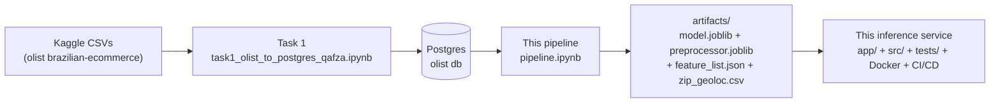
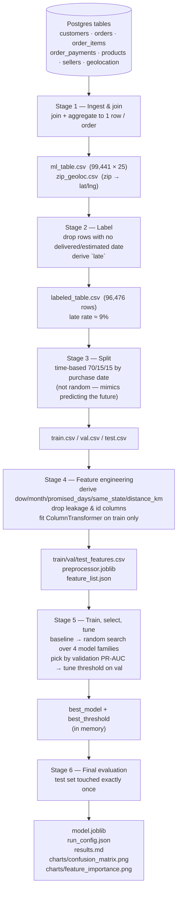

# Olist Late-Delivery Inference Service

Predicts whether a new order will arrive **after** its estimated delivery
date, with a probability — served as a FastAPI inference service in
containers, built from a model already trained in the notebooks below.
Training stays out of the inference path; this service only loads what the
notebooks already produced and never re-fits anything.

**Target:** `late` — order-purchase-time prediction, ~9% positive rate
(imbalanced, weak-signal: PR-AUC ~0.12 against a 0.053 base rate — a
probability/score is a more honest thing to show than a hard yes/no).

---

## Quickstart — run from zero

```bash
git clone https://github.com/Ayham162/olist-delivery-prediction-api.git
cd olist-delivery-prediction-api
cp .env.example .env          # fill in real values (a placeholder DB password is fine locally)
docker compose up --build     # api + db, one command, nothing else needed
```

Then:

```bash
curl -X POST http://localhost:8000/predict -H "Content-Type: application/json" -d '{
  "n_items": 1, "n_distinct_products": 1, "n_distinct_sellers": 1,
  "total_price": 120.5, "total_freight_value": 15.0, "avg_item_price": 120.5,
  "total_weight_g": 500, "max_installments": 3, "n_payment_methods": 1,
  "main_payment_type": "credit_card", "customer_state": "SP",
  "customer_zip_code_prefix": 1310, "seller_state": "RJ",
  "seller_zip_code_prefix": 20040,
  "order_purchase_timestamp": "2018-05-10T14:22:00",
  "order_estimated_delivery_date": "2018-05-25T00:00:00"
}'
# {"late":false,"probability":0.6113450641808283,"model_version":"logistic_regression@threshold=0.71"}
```

Interactive docs at `http://localhost:8000/docs`. `docker compose down -v` to
tear down (including the database volume).

---

## Repository structure — why each folder exists

| Folder | What's in it | Why it's separate |
|---|---|---|
| `app/` | `main.py` — the FastAPI app | Thin HTTP layer only: routing, request/response typing, exception-to-status translation. No ML/business logic here — that all lives in `src/`, so it's testable without an HTTP server. |
| `src/inference_service/` | `config.py`, `logger.py`, `schemas.py`, `preprocessing.py`, `features.py`, `predict.py`, `validation.py`, `db.py` | The actual service library, importable and unit-testable independent of the API. |
| `config/config.yaml` | Every path, threshold, and setting | Nothing in `app/`/`src/` hardcodes a path or the 0.71 threshold — swap environments without touching code. |
| `models/`, `data/` | Serving-time artifacts (`model.joblib`, `preprocessor.joblib`, `feature_list.json`, `run_config.json`, `zip_geoloc.csv`) | DVC-tracked (`models.dvc`/`data.dvc`), not committed to git directly — content-hashed, so any result traces back to the exact artifact version. |
| `notebooks/` | The 6 training notebooks + `pipeline.ipynb` (the condensed, re-runnable version) + their `artifacts/` | Training stays here per the task brief — the inference service never fits anything, only loads what these produced. |
| `tests/{unit,data,integration}/` | pytest suite | Three different failure classes: our code (`unit`), the training data itself (`data`), the wired-together HTTP app (`integration`). |
| `scripts/` | `register_model.py` | One-off ops scripts (MLflow registration) — deliberately separate from `src/`, which stays pure library code. |
| `db/init.sql` | Postgres schema for `prediction_logs` | Runs automatically on the `db` container's first boot (`docker-entrypoint-initdb.d`). |
| `.github/workflows/ci.yml` | CI pipeline | Lint, test, build — see [CI/CD](#cicd) below. |

---

## Configuration

Everything the service needs is in `config/config.yaml` (checked in — it's a
fact about this trained model, not a secret) plus `.env` (gitignored — copy
from `.env.example`) for anything environment-specific: DB connection
strings, the MLflow tracking URI. `.env` values are substituted into
`config.yaml`'s `${VAR}` placeholders at startup (`src/inference_service/config.py`).

Paths in `config.yaml` are resolved against the repo root (not the process's
working directory), so the service behaves the same whether it's run via
`pytest`, `uvicorn`, or inside Docker.

---

## Running locally without Docker

```bash
python -m venv .venv
.venv/Scripts/activate            # .venv/bin/activate on macOS/Linux
pip install -r requirements.txt -r requirements-dev.txt
pip install --no-deps -e .        # makes `inference_service` importable
uvicorn app.main:app --reload
```

`requirements.txt` is runtime-only (what the container needs);
`requirements-dev.txt` adds pytest/black/flake8/isort/pre-commit on top —
the production image never installs the latter.

---

## API

| Route | What it does |
|---|---|
| `GET /health` | Process up + whether the model actually loaded (doesn't crash if it didn't — reports `"degraded"`). |
| `GET /model/info` | Model type, threshold, version, and **which source served it** — `mlflow:<name>@<alias>` or `joblib:local` (see [Experiment tracking](#experiment-tracking--model-registry-mlflow)). |
| `POST /predict` | One order in, `{late, probability, model_version}` out. |
| `POST /predict/batch` | List of orders in, list of results out. |
| `GET /metrics` | Prometheus format — request count/latency/status-code breakdown per route. |
| `GET /docs` | Auto-generated interactive API docs (FastAPI/Swagger). |

Request validation happens in two independent layers:

1. **pydantic** (`schemas.OrderInput`) — types, ranges, required fields. A
   malformed request never reaches the model; FastAPI returns 422
   automatically.
2. **Great Expectations** (`validation.py`) — things pydantic's type system
   can't express: `customer_state`/`seller_state` must be real Brazilian
   state codes (not just 2 letters), `main_payment_type` must be one of the
   platform's actual payment methods. A failure here also returns 422, with
   the specific failed expectation in the body — **rejected**, not flagged
   or silently defaulted, so a bad guess at a state code never produces a
   confident-looking prediction.

Anything else unexpected returns a generic 500 with the full traceback
logged server-side only — never leaked to the client.

---

## Testing

```bash
pytest
```

Runs everything in one command: `tests/unit/` (preprocessing, feature
assembly, prediction, the Great Expectations gate), `tests/data/`
(`03_test.csv`'s schema, a leakage-column guard so a delivery-outcome column
can never end up in the model's inputs), `tests/integration/` (the actual
FastAPI app via `TestClient` — both 422 paths, batch predict, `/docs`).

`tests/unit/test_predict.py::test_predict_one_matches_verified_notebook_output`
is worth calling out specifically: it asserts the service's prediction for a
fixed order matches, to `1e-9`, a value that was independently cross-checked
against a from-scratch reconstruction of `pipeline.ipynb`'s own transform
(max abs diff `0.0` across the full feature matrix). That's "the pipeline
reproduces the notebook" as a permanent, automated check, not a one-off
claim.

---

## Data versioning, validation, and experiment tracking

**DVC** — `models/`, `data/`, and `notebooks/artifacts/` are tracked by
content hash (`*.dvc` files, committed) rather than committed to git
directly. `dvc push`/`dvc pull` move the actual bytes to/from the configured
remote. Any result — a prediction, a metric — traces back to the exact
artifact version that produced it.

**Great Expectations** — see [API](#api) above; the request-time data
quality gate, deliberately scoped to what pydantic can't express.

**MLflow** — `scripts/register_model.py` logs the already-trained model's
params/metrics to an experiment run and registers it under a `"production"`
**alias** (not a "stage" — those were deprecated in MLflow 2.9+). The
service's `get_model()` tries `models:/olist-late-delivery@production`
first and falls back to the local `models/model.joblib` if the tracking
server is unreachable (logged at WARNING, not silent) — deliberately fast to
fail over: an unreachable server hangs on MLflow's own defaults for
90+ seconds, so the service overrides the HTTP timeout/retry settings to
fail over in ~4 seconds instead. Re-run `scripts/register_model.py` whenever
a new model is chosen.

---

## Monitoring

- **`GET /metrics`** — request count, latency histograms, status-code
  breakdown, in Prometheus's own format (`prometheus-fastapi-instrumentator`
  — not hand-rolled).
- **`prediction_logs` table** (Postgres, `db/init.sql`) — every prediction's
  input, output, model version, and latency, written by
  `src/inference_service/db.py`. This *is* the "store predictions to
  evaluate later" requirement: once an order's real
  `order_delivered_customer_date` becomes known (from wherever order
  fulfillment data eventually lands), join it back to `prediction_logs` on
  whatever the caller used as an order identifier to compute real-world
  precision/recall, not just the offline test-set numbers above. The DB
  write is **non-fatal by design** — a Postgres outage degrades logging,
  never predictions, since `/predict` itself never queries the database
  (see [API](#api)/[Repository structure](#repository-structure--why-each-folder-exists)).
- **What we'd alert on:**
  - Error rate spike (5xx rate crossing some threshold, from `/metrics`).
  - p95 latency above some threshold — `/metrics`' histogram.
  - Predicted positive rate drifting far from the ~9% base rate training
    data had, with no corresponding code/model change — a proxy for input
    or concept drift, since ground truth for a `late` prediction isn't
    available for weeks (the order hasn't been delivered yet). Query
    `prediction_logs` for this; it's the same table the ground-truth
    join above uses.

---

## CI/CD

`.github/workflows/ci.yml` — three jobs on every push: `lint`
(black/isort/flake8), `test` (pytest), `docker-build` (needs both to pass
first). A failing test or lint violation stops the pipeline — `docker-build`
never runs if `test` or `lint` are red.

One thing worth knowing if you're extending this: `models/`, `data/`, and
`notebooks/artifacts/03_test.csv` are DVC-tracked, not in git, so a fresh
CI checkout doesn't have them. The local DVC remote used for dev
(`../dvc-storage`) is a path on the development machine only — unreachable
from GitHub's runners. A production setup would `dvc pull` from a
cloud-backed remote (S3/GCS) using credentials in repo secrets; without
provisioning cloud storage for this exercise, CI instead fetches the same
small (~5MB) artifacts from a
[GitHub Release asset](https://github.com/Ayham162/olist-delivery-prediction-api/releases/tag/ci-fixtures-v1)
over plain HTTPS — documented in the workflow file itself. Regenerate that
release whenever `models/`/`data/`/`03_test.csv` change.

---

## Training pipeline (background)

Everything below documents where the served model actually came from —
training itself is out of scope for this service (see the task brief); this
section is retained so the service's design decisions are traceable to
their source.

Condensed, re-runnable version of the `task2/01,02,03,05,06_*.ipynb`
notebooks, minus the EDA and exploratory dumps (`task2/04_eda.ipynb` still
owns that). One notebook, [`pipeline.ipynb`](pipeline.ipynb), six stages,
from raw Postgres tables to a saved model.

### Prerequisites (for re-running training, not for the service above)

1. `docker-compose up` in the outer `Qafza/` course workspace (a separate,
   non-git folder — **not this repo**) — starts a Postgres container loaded
   with the Olist dataset.
2. Run `task1_olist_to_postgres_qafza.ipynb` once — loads the Olist CSVs
   into that database.
3. Use the `olist_mlops` conda env as the notebook kernel.

Then run `pipeline.ipynb` top to bottom. It writes everything to
`notebooks/artifacts/` (created on first run).

### System-level flow



### Pipeline stages



### Artifacts produced at each step

| Stage | File | What it is |
|---|---|---|
| 1 | `artifacts/ml_table.csv` | One row per order, raw joins/aggregates, no label yet |
| 1 | `artifacts/zip_geoloc.csv` | zip-code prefix → mean lat/lng lookup |
| 2 | `artifacts/labeled_table.csv` | `ml_table` + `late` target, unlabelable rows dropped |
| 3 | `artifacts/train.csv`, `val.csv`, `test.csv` | Time-ordered split (oldest → newest) |
| 4 | `artifacts/train_features.csv`, `val_features.csv`, `test_features.csv` | Post-preprocessing numeric matrices (debug/inspection only) |
| 4 | `artifacts/preprocessor.joblib` | Fitted `ColumnTransformer` (impute + scale + one-hot) |
| 4 | `artifacts/feature_list.json` | Ordered column names the model expects |
| 6 | `artifacts/model.joblib` | Final fitted classifier |
| 6 | `artifacts/run_config.json` | Model type, hyperparameters, decision threshold |
| 6 | `artifacts/results.md` | Test-set metrics + confusion matrix, human-readable |
| 6 | `charts/confusion_matrix.png`, `charts/feature_importance.png` | Evaluation plots |

### Current model (last run)

- **Algorithm:** Logistic Regression, `C=10, max_iter=1000, class_weight="balanced"`
- **Decision threshold:** 0.71 (max F1 on validation)
- **Test metrics (touched once):** accuracy 0.817, precision 0.098, recall 0.215, F1 0.134, ROC-AUC 0.669, PR-AUC 0.116
- **Top features:** `promised_days`, `distance_km`, `same_state`, `total_price`, `avg_item_price`

### What the inference service actually needs

Only **five** of the artifacts above are serving-time dependencies —
everything else in `notebooks/artifacts/` is training-time-only (debugging,
audit trail, reproducibility):

- `preprocessor.joblib`
- `model.joblib`
- `feature_list.json`
- `run_config.json` (model type, hyperparameters, and the `threshold`)
- **`zip_geoloc.csv`** — easy to miss: `distance_km` is computed from it at
  feature-engineering time, so the service needs the same zip → lat/lng
  lookup available at request time, not just at training time.

A single prediction request has to supply — or the service has to compute —
the same raw, order-level fields Stage 1 aggregates from the DB tables,
since there's no per-order Postgres row to join against for a brand-new
order:

| Field | Source in this pipeline |
|---|---|
| `n_items`, `n_distinct_products`, `n_distinct_sellers`, `total_price`, `total_freight_value`, `avg_item_price` | aggregated from the order's line items |
| `total_weight_g` | summed product weight across line items |
| `max_installments`, `n_payment_methods`, `main_payment_type` | aggregated from the order's payments |
| `customer_state`, `customer_zip_code_prefix` | customer record |
| `seller_state`, `seller_zip_code_prefix` | the order's main seller (highest-value item) |
| `order_purchase_timestamp` | order metadata → derives `purchase_dow`, `purchase_month` |
| `order_estimated_delivery_date` | order metadata → derives `promised_days` with purchase timestamp |

`same_state` and `distance_km` are then derived exactly as in Stage 4 — see
`src/inference_service/preprocessing.py`, which mirrors these cells
directly.

### Relationship to the rest of the (outer, non-git) workspace

These live outside this repository, in the course workspace this repo was
extracted from:

- `task1_olist_to_postgres_qafza.ipynb` — populates the Postgres DB this
  training pipeline reads from.
- `task2/` — the original, exploratory notebook-by-notebook version
  (includes `04_eda.ipynb`, the analysis behind several decisions baked into
  Stage 4 here, e.g. dropping `main_product_category`).
- `experiments/pipeline.ipynb` — a separate, more rigorous MLOps sandbox
  doing rolling-origin cross-validation and paired significance testing on
  candidate feature additions. Not merged into this pipeline; the sealed
  test set there is still gated behind a `TOUCH_TEST` flag.
