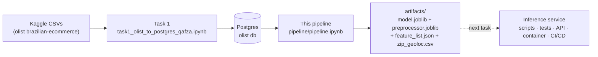
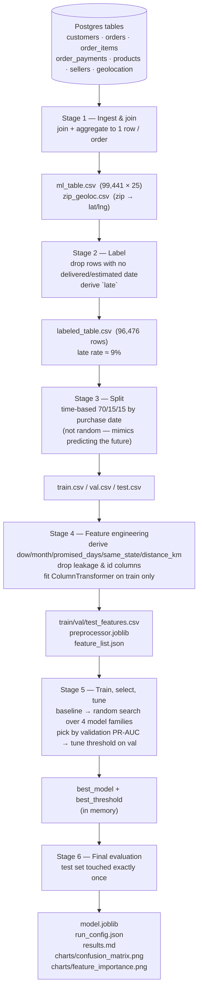

# Olist Late-Delivery Prediction — Pipeline

Condensed, re-runnable version of the `task2/01,02,03,05,06_*.ipynb` notebooks, minus the
EDA and exploratory dumps (`task2/04_eda.ipynb` still owns that). One notebook,
[`pipeline.ipynb`](pipeline.ipynb), six stages, from raw Postgres tables to a saved model.

**Target:** `late` — will a delivered order arrive after its estimated delivery date?
Predicted at order-purchase time. ~9% positive rate (imbalanced).

## Prerequisites

1. `docker-compose up` (root of the repo) — starts the Postgres container.
2. Run `task1_olist_to_postgres_qafza.ipynb` once — loads the Olist CSVs into that database.
3. Use the `olist_mlops` conda env as the notebook kernel.

Then run `pipeline/pipeline.ipynb` top to bottom. It writes everything to
`pipeline/artifacts/` and `pipeline/charts/` (created on first run).

## System-level flow

## Pipeline stages

## Artifacts produced at each step

| Stage | File | What it is |
|---|---|---|
| 1 | `artifacts/ml_table.csv` | One row per order, raw joins/aggregates, no label yet |
| 1 | `artifacts/zip_geoloc.csv` | zip-code prefix → mean lat/lng lookup |
| 2 | `artifacts/labeled_table.csv` | `ml_table` + `late` target, unlabelable rows dropped |
| 3 | `artifacts/train.csv`, `val.csv`, `test.csv` | Time-ordered split (oldest → newest) |
| 4 | `artifacts/train_features.csv`, `val_features.csv`, `test_features.csv` | Post-preprocessing numeric matrices (debug/inspection only) |
| 4 | `artifacts/preprocessor.joblib` | Fitted `ColumnTransformer` (impute + scale + one-hot) |
| 4 | `artifacts/feature_list.json` | Ordered column names the model expects |
| 6 | `artifacts/model.joblib` | Final fitted classifier |
| 6 | `artifacts/run_config.json` | Model type, hyperparameters, decision threshold |
| 6 | `artifacts/results.md` | Test-set metrics + confusion matrix, human-readable |
| 6 | `charts/confusion_matrix.png`, `charts/feature_importance.png` | Evaluation plots |

## Current model (last run)

- **Algorithm:** Logistic Regression, `C=10, max_iter=1000, class_weight="balanced"`
- **Decision threshold:** 0.71 (max F1 on validation)
- **Test metrics (touched once):** accuracy 0.817, precision 0.098, recall 0.215, F1 0.134, ROC-AUC 0.669, PR-AUC 0.116
- **Top features:** `promised_days`, `distance_km`, `same_state`, `total_price`, `avg_item_price`

This is a weak-signal problem (PR-AUC ~0.12 against a 0.053 base rate) — worth knowing
going into the service work, since it shapes what "success" looks like for the API
(e.g. exposing a probability/score rather than a hard yes/no may be more honest than the
tuned threshold above).

## What the inference service actually needs

Only **four** of the artifacts above are serving-time dependencies — everything else in
`artifacts/` is training-time-only (debugging, audit trail, reproducibility):

- `preprocessor.joblib`
- `model.joblib`
- `feature_list.json`
- `run_config.json` (for the `threshold` value)
- **`zip_geoloc.csv`** — easy to miss: `distance_km` is computed from it at feature-engineering
  time, so the service needs the same zip → lat/lng lookup available at request time, not
  just at training time.

A single prediction request has to supply — or the service has to compute — the same raw,
order-level fields Stage 1 aggregates from the DB tables, since there's no per-order
Postgres row to join against for a brand-new order:

| Field | Source in this pipeline |
|---|---|
| `n_items`, `n_distinct_products`, `n_distinct_sellers`, `total_price`, `total_freight_value`, `avg_item_price` | aggregated from the order's line items |
| `total_weight_g` | summed product weight across line items |
| `max_installments`, `n_payment_methods`, `main_payment_type` | aggregated from the order's payments |
| `customer_state`, `customer_zip_code_prefix` | customer record |
| `seller_state`, `seller_zip_code_prefix` | the order's main seller (highest-value item) |
| `order_purchase_timestamp` | order metadata → derives `purchase_dow`, `purchase_month` |
| `order_estimated_delivery_date` | order metadata → derives `promised_days` with purchase timestamp |

`same_state` and `distance_km` are then derived exactly as in Stage 4.

## Relationship to the rest of the repo

- [`task1_olist_to_postgres_qafza.ipynb`](../task1_olist_to_postgres_qafza.ipynb) — populates the Postgres DB this pipeline reads from.
- [`task2/`](../task2/) — the original, exploratory notebook-by-notebook version (includes `04_eda.ipynb`, the analysis behind several decisions baked into Stage 4 here, e.g. dropping `main_product_category`).
- [`experiments/pipeline.ipynb`](../experiments/pipeline.ipynb) — a separate, more rigorous MLOps sandbox doing rolling-origin cross-validation and paired significance testing on candidate feature additions. Not merged into this pipeline; the sealed test set there is still gated behind a `TOUCH_TEST` flag.
